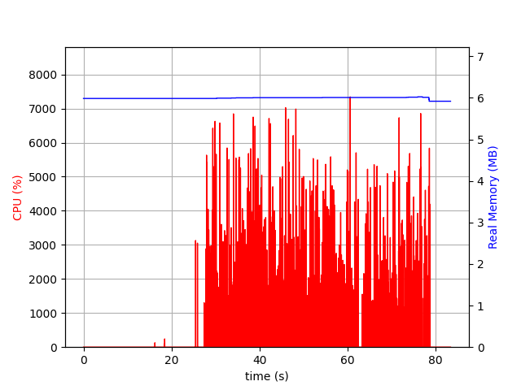

# ghstat

## Instruction

This project is to test the performance of rust. the metrics is memory usage, cpu usage, and I/O usage.

## Conclusion

Rust is a good language to write a high performance program. Especially for computing intensive program. For I/O operation, using tokio as the async runtime is a good choice.

- performance



[https://github.com/Jianxuan-Li/rust-draw-image-test](https://github.com/Jianxuan-Li/rust-draw-image-test)

## Development

https://freeyeti.net/backend/ghstat/v1/s

```
DATA_DIR=
```

- `cargo run`

```bash
docker build -t freeyeti/ghstat:latest .
docker push freeyeti/ghstat:latest
```

- clear image cache of github

```bash
#!/bin/bash
curl -X PURGE https://camo.githubusercontent.com/3d54f5ac5388d5a17c451350823ee67d9a062802b43a6b48e91ddce6db268d8e/68747470733a2f2f66726565796574692e6e65742f6261636b656e642f6768737461742f76312f733f723d31
```
